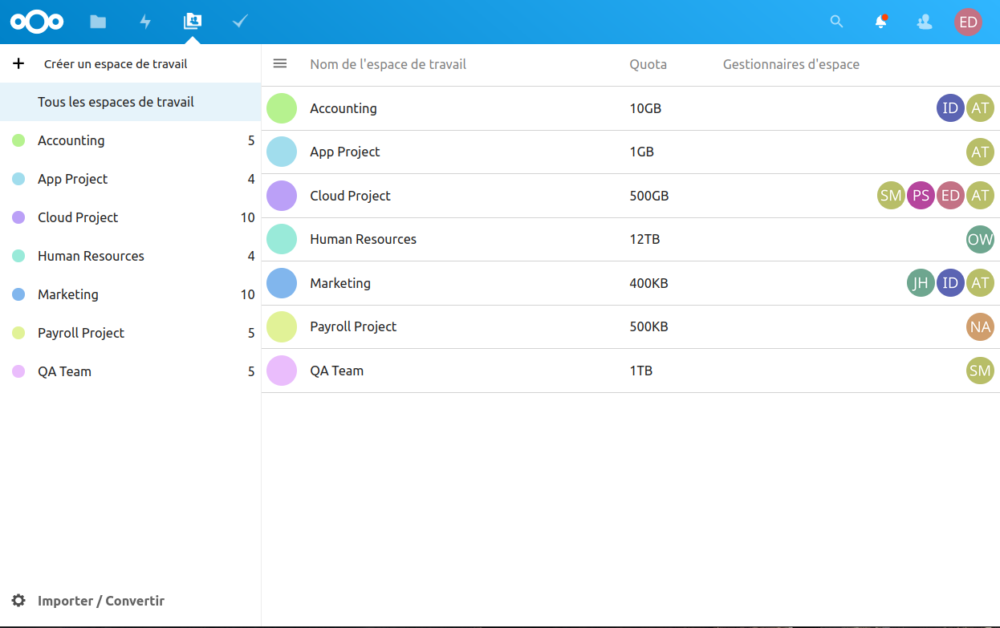

# Workspace
Create shared workspaces and delegate management of their members and groups.

<p align="center">

</p>

Workspace allows managers to :
- Create shared workspaces
- Delegate management of each workspace to users (workspace managers) in order for them to :
  - choose members
  - create groups
  - configure advanced permissions on workspace folders
- All through a simple unified interface, designed to simplify your users' experience and make them autonomous

This app is a Nextcloud extension of the Groupfolders app.

For more information, please visit [our website](https://www.arawa.fr/solutions/produits-arawa/arawa-workspace-for-nextcloud/) (french content).

> [!WARNING]
> We found an incompatibility with the latest release of Groupfolders.
>
> These are the compatible versions until we address those issues:
> 
> | Workspace | GroupFolders |
> | :---: | :---: |
> | all versions | 16.0.0 to 16.0.9 |
> | all versions | 17.0.0 to 17.0.3 |

## Documentation

For more details, please go to the [admin documentation](https://github.com/arawa/workspace/blob/main/README.md#installation), or [user documentation](https://github.com/arawa/workspace/tree/main/docs/user-guide/from-3.X.X).

## Installation
### Requirements

#### From Nextcloud 25

- PHP 8.0
- Nextcloud 25 or after
- Install Group Folders on the Nextcloud app store

#### For Nextcloud 24 and before

- PHP 7.4 to 8.1
- Nextcloud 21 to 24
- Our forked Groupfolders app, available on https://github.com/arawa/groupfolders, release [v9.2.1](https://github.com/arawa/groupfolders/releases/download/v9.2.1/groupfolders-9.2.1.tar.gz)

### Limit the Workspace app to specific groups

In your "application management" administrator interface, limit the application to the following groups: `GeneralManager` and `WorkspacesManagers`.

### 🔧 Configure Groupfolders for Workspace

#### From Nextcloud 25

In `Settings` > `Group folders` > `Group folder admin delegation` section, add the group `GeneralManager` to the **first** field, and the group `WorkspacesManagers` to the **second** field


#### For Nextcloud 24 and before

In `Settings` > `Group folders` > `Group folder admin delegation` section, add the groups `GeneralManager` and `WorkspacesManagers`.

### Define which users will be General Managers

Add the users in charge of creating Workspaces to the GeneralManager group.


## Development and Build
### Requirements
- npm v7.24.1
- composer v2.0.13
- make v3.82
- git v1.8

### 📦 Building the app

First, clone into your apps directory (example: `/var/www/html/nextcloud/apps/`).

```bash
git clone https://github.com/arawa/workspace.git
```

Then, you can build app :

```bash
cd workspace
make
```

🚨 **Caution** : You must install `npm` and `composer` before use `make` command line.

If it's okay, we can use or dev the Workspace app !

### 📦 Create an artifact

```bash
make source
```

An artifact will be created in the `build/artifacts/source` from the project.


### 📦 For Nextcloud 21 and 24, build [Arawa\Groupfolders](https://github.com/arawa/groupfolders)

Clone this app into your apps directory (example: `/var/www/html/nextcloud/apps/`) and switch of the branch to be in `allow-admin-delegation-stable21`.

```bash
git clone https://github.com/arawa/groupfolders.git
cd groupfolders
git checkout allow-admin-delegation-stable21
```

Then, you can build.

```bash
make
```

🚨 **Caution** : You must install `npm` and `composer` before use `make` command line.

After this, you can enable the Groupfolders app.

### 📋 Running tests

#### Front-end

```bash
npm run test
```

#### Back-end

```bash
composer run test
```

or

```bash
sudo -u nginx /usr/local/bin/composer run test
```

## Security Issues

Please, read the [security.txt](.well-known/security.txt).

If you want to report us a security issue. Please, read our [security-policy.md](.well-known/security-policy.md) file.
